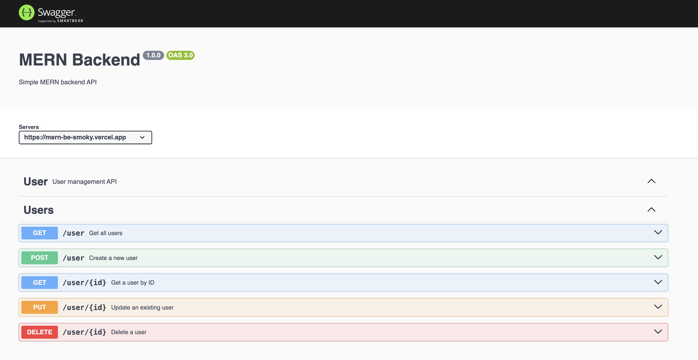

# MERN Backend

A simple backend application built with:
- Node with Express
- MongoDB
- Swagger UI Express

###

Swagger link https://mern-be-smoky.vercel.app/api-docs/

## Getting Started

To get started, clone this repository and run `npm install` to install the dependencies. Then, run `node index.js` to start the development server.

To open swagger UI you can go to `http://localhost:3000/api-docs/`

## Database

The database using MongoDB. Database name is `user`

## Live Application

This application is deployed using Vercel and MongoDB Atlas.
To check live application try hit using `curl https://mern-be-smoky.vercel.app/user`
